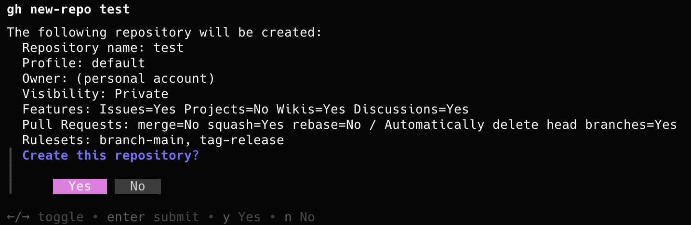
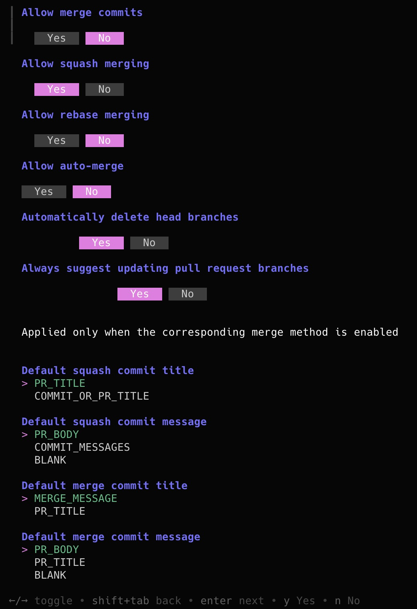
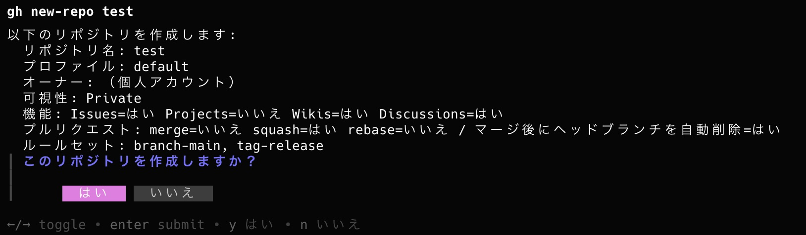
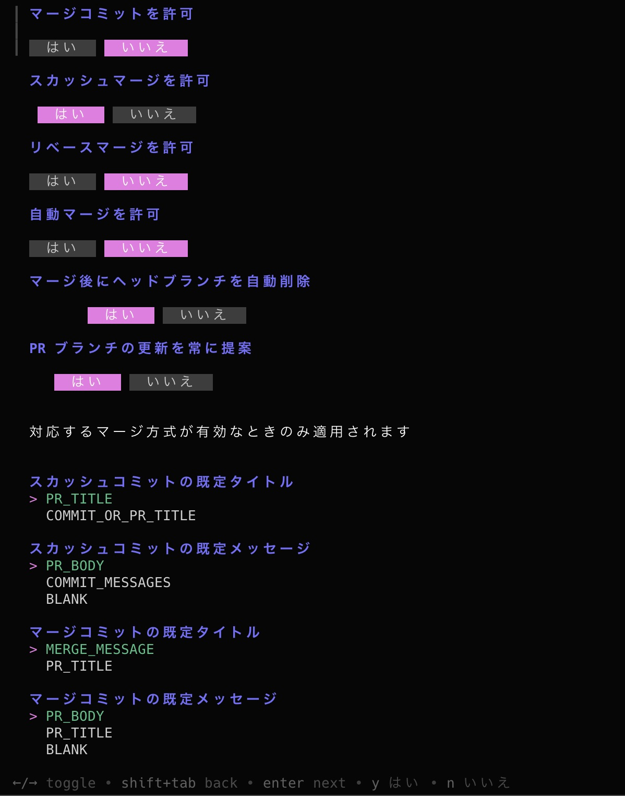

# gh-new-repo

[English](README.md) | [日本語](README.ja.md)

A [`gh`](https://cli.github.com/) extension that saves you from reconfiguring visibility, merge methods, and other repository settings every time you create a GitHub repository.

Save your preferred settings as named profiles, then reuse them through an interactive form or a single command. Repository creation is delegated to the official `gh repo create` command. Settings unavailable there—such as Projects, Discussions, and pull request merge options—are applied afterwards through the GitHub API.

## Highlights

- Store visibility, features, pull request options, and other settings in YAML profiles
- Open a repository creation form pre-filled from the selected profile
- Create repositories non-interactively by name, with a summary and confirmation before execution
- Use common `gh repo create` flags such as `--source`, `--template`, `--clone`, and `--push`
- Apply a profile to an existing repository
- Use the interface in English or Japanese
- Optionally apply saved rulesets from [`gh-rulekit`](https://github.com/nobuo-miura/gh-rulekit)

## Screenshots

`gh new-repo <name>` shows a summary and asks for confirmation before anything is created:



Run it without a name (or with `--interactive`) to go through every setting in a form:



<details><summary>Japanese UI</summary>





</details>

## Requirements

- [`gh`](https://cli.github.com/) installed and authenticated, for example with `gh auth login`
- [`gh-rulekit`](https://github.com/nobuo-miura/gh-rulekit) installed only if you want ruleset integration

No additional token or API key is required.

## Installation

```sh
gh extension install nobuo-miura/gh-new-repo
```

This command installs the latest precompiled binary published through GitHub Releases. Until the first release is available, use the [local development installation](#development) described below.

## Quick start

Create a profile first. There are no built-in profiles, so the first run opens a form where you can choose your defaults. The first profile automatically becomes the default.

```sh
gh new-repo profile new personal
```

You can then reuse the default profile by specifying only a repository name. Before creating the repository, the command shows a summary and asks for confirmation.

```sh
gh new-repo my-repo
```

Omit the repository name when you want to review or change every setting in the form.

```sh
gh new-repo
```

## Usage

### Create a repository

```sh
# Create with the default profile
gh new-repo my-repo

# Select a profile
gh new-repo my-repo --profile oss

# Create under an organization
gh new-repo my-org/my-repo --profile oss

# Override profile defaults with flags
gh new-repo my-repo --public -d "Description" -g Go -l mit --clone

# Create from a local repository and push its commits
gh new-repo my-repo --source=. --push

# Open the form with the repository name pre-filled
gh new-repo my-repo --interactive

# Skip confirmation
gh new-repo my-repo --yes

# Preview the operations without making changes
gh new-repo my-repo --dry-run
```

| Invocation | Behavior |
|---|---|
| `gh new-repo` | Select a profile when needed, then open the creation form |
| `gh new-repo <name>` | Apply a profile, show a summary, and ask for confirmation |
| `gh new-repo <name> --yes` | Create without the confirmation prompt |
| `gh new-repo <name> --interactive` | Open the form with the repository name pre-filled |

### `gh repo create`-compatible flags

The following flags are supported:

`--public` `--private` `--internal` `-d/--description` `-g/--gitignore` `-l/--license` `--add-readme` `--disable-issues` `--disable-wiki` `--homepage` `-t/--team` `-c/--clone` `-s/--source` `--push` `-r/--remote` `-p/--template` `--include-all-branches`

- Explicit flags override values from the profile. For example, `--description ""` clears the profile's description.
- `--public`, `--private`, and `--internal` are mutually exclusive.
- When `--source` or `--template` is set, the profile's README, `.gitignore`, and license settings are not passed on.
- `-p` is the short form of `--template`. Use `--profile` to select a profile.
- `--dry-run` prints the `gh repo create` arguments, the post-creation API request body, and ruleset commands. It makes no changes on GitHub.

### Manage profiles

```sh
gh new-repo profile new dev                 # Create a profile
gh new-repo profile new dev --from oss      # Seed it from another profile
gh new-repo profile new dev --set-default   # Create it and make it the default
gh new-repo profile default oss             # Change the default profile
gh new-repo profile list                    # List profiles
gh new-repo profile show oss                # Print a profile as YAML
gh new-repo profile edit oss                # Edit a profile in the form
gh new-repo profile edit                    # Edit the default profile
gh new-repo profile edit --file             # Open the config file in an editor
gh new-repo profile path                    # Print the config file path
```

`profile list` marks the default profile with `*`. For `profile edit --file`, the editor is selected from `GH_NEW_REPO_EDITOR`, `VISUAL`, and `EDITOR`, in that order.

### Apply a profile to an existing repository

```sh
gh new-repo apply owner/repo --profile personal
```

`apply` does not create a repository. It applies only the explicitly configured repository features, pull request settings, and rulesets. Initialization settings such as README, `.gitignore`, and license are ignored.

### Configure the display language

```sh
gh new-repo config language          # Choose Auto, English, or 日本語
gh new-repo config language ja       # Set auto, en, or ja directly
gh new-repo config show              # Show the current settings
```

The default `auto` mode detects the language from environment variables such as `LANG`. Pass `--lang en` or `--lang ja` to override the language for one invocation.

## Configuration file

Configuration is stored at `$XDG_CONFIG_HOME/gh-new-repo/config.yml`. If `XDG_CONFIG_HOME` is unset, the standard configuration directory for the operating system is used. The file is created on the first change, such as creating a profile or setting the language.

```yaml
language: auto
default_profile: personal
profiles:
  personal:
    description: ""
    visibility: private
    features:
      issues: true
      projects: false
      wiki: false
      discussions: false
    pull_requests:
      allow_merge_commit: false
      allow_squash_merge: true
      allow_rebase_merge: false
      allow_auto_merge: true
      delete_branch_on_merge: true
      allow_update_branch: true
      squash_merge_commit_title: PR_TITLE
      squash_merge_commit_message: PR_BODY
    init:
      add_readme: false
      gitignore_template: ""
      license_template: ""
    rulesets:
      - protect-default
```

- Omitting a boolean under `features` or `pull_requests` means “leave this setting unchanged.” This lets `apply` preserve selected settings on an existing repository.
- Saving from the interactive form explicitly records every boolean shown in the form.
- `init` is used only when creating a repository.

## gh-rulekit integration

With `gh-rulekit` installed, you can associate saved rulesets with a profile and apply them after repository creation or during `apply`.

```sh
gh extension install nobuo-miura/gh-rulekit
gh rulekit export owner/some-repo --name main --as protect-default
```

The `gh new-repo`, `profile new`, and `profile edit` forms display a checklist of saved rulesets. If `gh-rulekit` is unavailable, the checklist is hidden and the profile's `rulesets` entries are skipped.

## Supported settings

| Group | Settings | Applied through |
|---|---|---|
| General | Description and visibility | `gh repo create` |
| Init | README, `.gitignore`, and license | `gh repo create` |
| Features | Issues and Wikis | `gh repo create` and the GitHub API |
| Features | Projects and Discussions | GitHub API |
| Pull Requests | Merge methods, commit message defaults, auto-merge, branch deletion after merge, and branch update suggestions | GitHub API |
| Rulesets | Branch and tag rulesets | `gh-rulekit` |

### Currently unsupported

- Actions permissions such as `default_workflow_permissions`
- Security features
- Profile-managed collaborators and teams (`--team` is supported during creation)
- Topics
- Restrictions on who can create issues

## Development

```sh
make check
```

`make check` runs the build, tests, `gofmt`, `go vet`, and `golangci-lint`.

To install a local development checkout as a `gh` extension:

```sh
git clone https://github.com/nobuo-miura/gh-new-repo.git
cd gh-new-repo
make install
```

`make install` builds the binary and installs this repository as a symlink. Run `make build` after changing the code.

## License

[MIT License](LICENSE)
